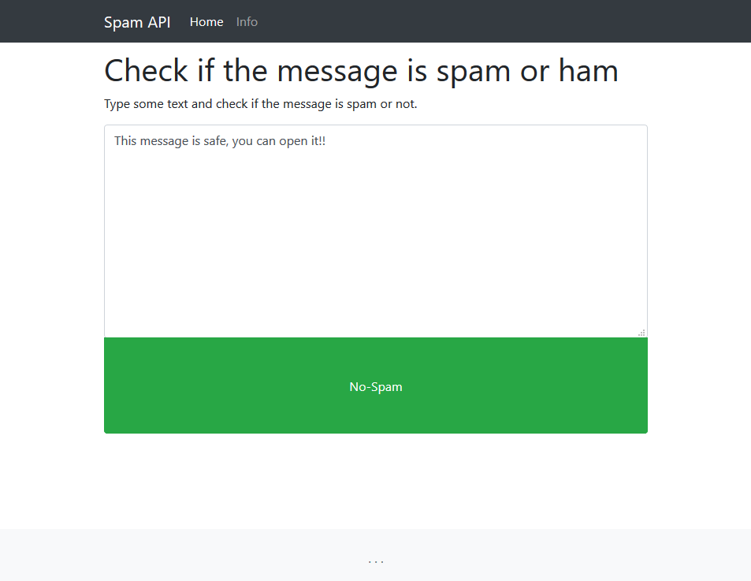

# Spam API

Type a message and check if it is spam or ham. This repository includes
a kubernetes deployment of an API along with a user interface where you
can type your messages and test them. Prediction model is trained using 
the SMS Spam Collection from 
[UCI Machine Learning Repository](https://archive.ics.uci.edu/ml/datasets/SMS+Spam+Collection).

## Installation and testing
First make sure that the DNS resolution works in your cluster otherwise 
you will need to use an IP address instead of the service name in order
to connect to the API. To check that type 
`(sudo) kubectl get pods -n kube-sytem` and the `coredns` pods should
be running. Check also the documentation here for more info 
https://kubernetes.io/docs/tasks/administer-cluster/dns-debugging-resolution/. 

The deployment `yaml` files are in located in the `k8s` directory. 
1. Deploy the secrets `kubectl apply -f secrets.yaml`.
2. Deploy the api and the corresponding service `kubectl apply -f api.yaml`.
3. Set the API URL in the webapp deployment (don't forget the `http://`). The URL
   is the `http://<api-service-name>.<api-namespace>:<api-service-port>/<endpoint-of-view-function>`.
4. Deploy the web app `kubectl apply -f webapp.yaml`. 
5. If you use Minikube use the Nodeport to test it. Get minikube IP
 (`sudo minikube ip`) and webapp-nodeport port (`sudo kubectl get svc`) and 
 open your browser at `<minikube-ip>:<webapp-nodeport-port>`.

Otherwise, you can test the API directly, from inside the cluster with: 
`curl --header "Content-Type: application/json" --request POST --data '{"text": "test message"}' http://<api-svc>:<api-svc-port>/v1/spam-ham`.

Tested using
* Minikube v1.0.1
* kubectl client v1.14.1
* kubectl server v1.14.1
* docker client v18.09.5
* docker server v18.09.5
